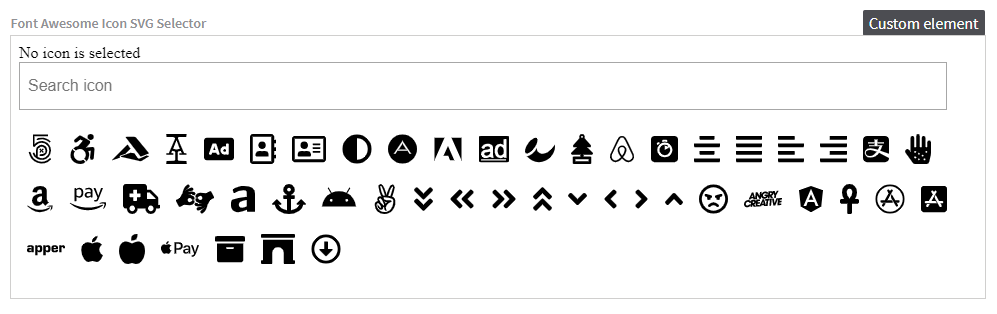

# Font Awesome Icon SVG Selector

[](https://stackoverflow.com/tags/kentico-kontent)
[](https://app.netlify.com/sites/kontent-custom-element-font-awesome-selector-svg/deploys)

## A custom element for Kentico Kontent

This is a [custom element](https://docs.kontent.ai/tutorials/develop-apps/integrate/integrating-your-own-content-editing-features) for [Kentico Kontent](https://kontent.ai) that allows you to pick [Font Awesome Icon](https://fontawesome.com/icons).



The custom element is storing the **svg of the picked icon**. As a data storage a [local JSON file](https://fontawesome.com/icons) is used.

:bulb:

If you want to take a look to another approach shat stores the *icon codename*, take a look to the sibling repository [kontent-custom-element-font-awesome-selector-codename](https://github.com/Simply007/kontent-custom-element-font-awesome-selector-codename).

## Stored value

```json
{
  ...
  "elements": {
      "custom_element": {
        "type": "custom",
        "name": "Custom element",
        "value": "<svg xmlns=\"http://www.w3.org/2000/svg\" viewBox=\"0 0 512 512\"><path d=\"M157.52 272h36.96L176 218.78 157.52 272zM352 256c-13.23 0-24 10.77-24 24s10.77 24 24 24 24-10.77 24-24-10.77-24-24-24zM464 64H48C21.5 64 0 85.5 0 112v288c0 26.5 21.5 48 48 48h416c26.5 0 48-21.5 48-48V112c0-26.5-21.5-48-48-48zM250.58 352h-16.94c-6.81 0-12.88-4.32-15.12-10.75L211.15 320h-70.29l-7.38 21.25A16 16 0 0 1 118.36 352h-16.94c-11.01 0-18.73-10.85-15.12-21.25L140 176.12A23.995 23.995 0 0 1 162.67 160h26.66A23.99 23.99 0 0 1 212 176.13l53.69 154.62c3.61 10.4-4.11 21.25-15.11 21.25zM424 336c0 8.84-7.16 16-16 16h-16c-4.85 0-9.04-2.27-11.98-5.68-8.62 3.66-18.09 5.68-28.02 5.68-39.7 0-72-32.3-72-72s32.3-72 72-72c8.46 0 16.46 1.73 24 4.42V176c0-8.84 7.16-16 16-16h16c8.84 0 16 7.16 16 16v160z\"/></svg>"
      }
    }
  ...
},
```

## Setup

1. Deploy the code to a secure public host
    * See [deploying section](#Deploying) for a really quick option
1. Follow the instructions in the [Kentico Kontent documentation](https://docs.kontent.ai/tutorials/develop-apps/integrate/integrating-your-own-content-editing-features#a-3--displaying-a-custom-element-in-kentico-kontent) to add the element to a content model.
    * The `Hosted code URL` is where you deployed to in step 1
    * No JSON parameters are necessary

## Deploying

Netlify has made this easy. If you click the deploy button below, it will guide you through the process of deploying it to Netlify and leave you with a copy of the repository in your GitHub account as well.

[](https://app.netlify.com/start/deploy?repository=https://github.com/Simply007/kontent-custom-element-font-awesome-selector-svg)

### Development

You can use following to set up the development environment

Prerequisites:

* Node.js
* git

```console
git clone https://github.com/Simply007/kontent-custom-element-font-awesome-selector-svg
cd kc-tui-editor-custom-element
npm install
npm run start
```

To build for production, run:

```console
npm run build
```

then deploy the contents of the `build` folder.

---

This project was bootstrapped with [Create React App](https://github.com/facebook/create-react-app).

## Team

This project was part of [Kentico Kontent](https://kontent.ai) Consulting and DevRel hackaton!

| <br /><sub>Ondřej Chrastina</sub><br/>[Github](https://github.com/Simply007) <br/>[Twitter](https://twitter.com/ChrastinaOndrej) | <br /><sub>Richard Šustek</sub><br/>[Github](https://github.com/enngage)<br/> &nbsp; | <br /><sub>Yuriy Sountsov</sub><br/>[Github](https://github.com/yuriys-kentico) <br/>[Twitter](https://twitter.com/sountsov) | <br /><sub>Rui Wang</sub><br/>[Github](https://github.com/RuiRayWang) <br/>[Twitter](https://twitter.com/RuiRayWang) |
| :---: | :---: | :---: | :---: |
